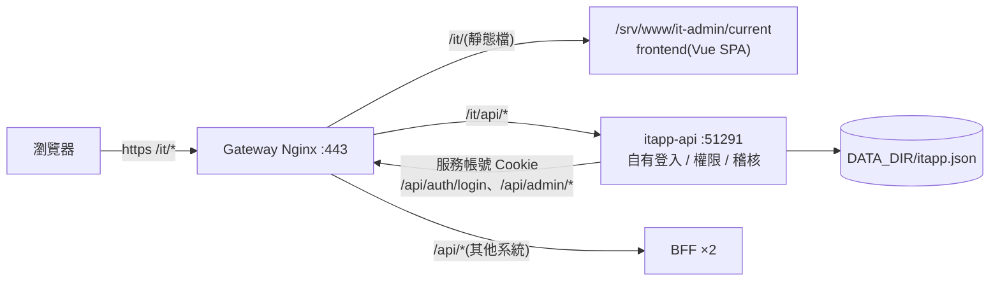
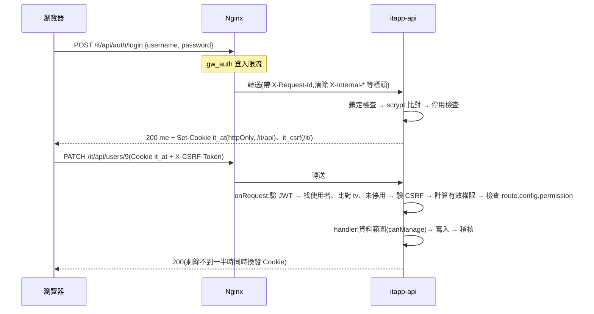
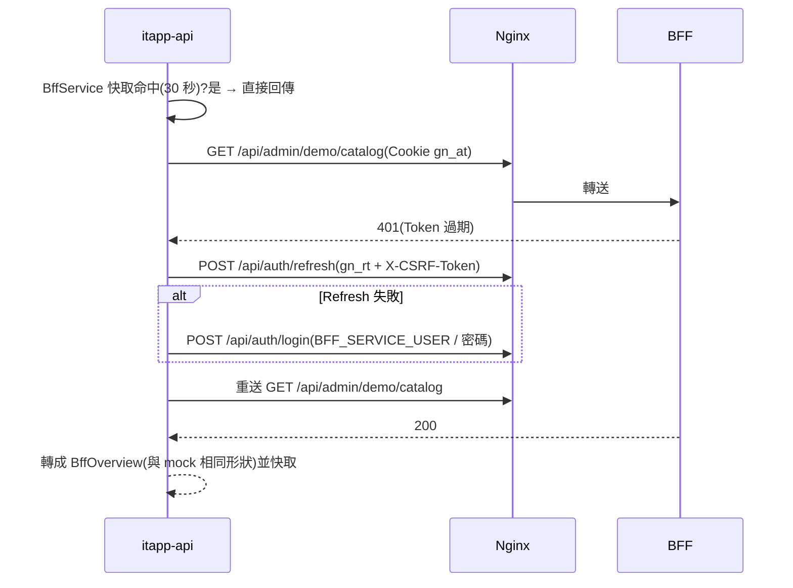

# IT 管理系統 — 架構與技術文件

> 對應 [PRD.md](PRD.md) v0.1。API 細節見 [API.md](API.md),前端 UI 規範見 [UI-GUIDE.md](UI-GUIDE.md)。

---

## 1. 整體架構



| 元件 | 位置 | 職責 |
| --- | --- | --- |
| **frontend** | `frontend/`,發佈到 `gw_www/it-admin` | Vue 3 SPA:登入頁、框架、全域 UI、各頁 |
| **itapp-api** | `backend/`,容器 `itapp-api:51291`(加入 Gateway 的 Docker 網路) | 登入 / Session / CSRF、權限計算、人員 / 部門 / 權限設定、稽核、BFF 資料聚合 |
| **Gateway Nginx** | `giga-api-gateway-bff/nginx/` | TLS、SPA 託管、`/it/api/` 轉送、登入限流、安全標頭、JSON 錯誤頁 |
| **Gateway BFF** | `giga-api-gateway-bff/bff/` | 資料來源(路由、上游、角色、權限、發佈版本);本系統**不修改** BFF |

## 2. 關鍵設計決策

| # | 決策 | 理由 | 取捨 |
| --- | --- | --- | --- |
| D1 | `/it/api/*` 由 Nginx **直接**轉 itapp-api,不經 BFF 路由表 | 需求:不共用單一入口;BFF 的 `/api/*` 一律要求 BFF 登入 | 登入限流、安全標頭改在 Nginx 的 `/it/api/` location 另外套用 |
| D2 | 上游以 Nginx 變數 `$itapp_api_upstream`(env `ITAPP_API_UPSTREAM`) | itapp-api 未部署時 Nginx 仍可啟動(同 Endpoint Server 做法) | 變數上游無法使用 upstream keepalive;流量小可接受 |
| D3 | Session = HS256 JWT(`userId`、`tv`、`jti`),**不含權限** | 權限調整需立即生效;單一 itapp-api 服務簽發與驗證,不需非對稱金鑰 | 每次請求計算權限(資料在記憶體,成本極低) |
| D4 | `tokenVersion`(`tv`)讓舊 Session 失效;登出以 jti 拒絕清單 | 停用 / 重設密碼要立即生效,不需 Session 表 | 拒絕清單在記憶體,重啟後遺失(v0.2 改 Redis) |
| D5 | 有效權限 = 職級權限 ∩ 部門限制;admin 固定全部 | 滿足「同職級不同課別」;避免把所有人鎖在外面 | 不支援個人例外權限(需要時再加) |
| D6 | 權限、選單定義在程式(`rbac/catalog.ts`),**對應關係**存資料 | 權限代碼與前端 `v-can` 綁定,新增需改程式;誰有什麼可隨時調整 | 新增權限需部署 |
| D7 | BFF 資料來源抽象為 `BffSource`:`mock`(快照)/ `live`(服務帳號) | 離線可開發;BFF 管理 API 未完成前可先用既有端點 | live 依賴 BFF dev / test 限定端點(見 §6) |
| D8 | BFF 尚無的寫入,live 模式回 501 `ITAPP_BFF_NOT_SUPPORTED` | 「失敗要明確說」,不假裝成功 | 畫面上的按鈕在 live 模式暫時只能提示 |
| D9 | 資料先存單一 JSON 檔(暫存檔 + rename 原子寫入、寫入排隊) | 基本框架階段不引入資料庫 | 只能單一實例;v0.2 改資料庫(PRD Q1) |
| D10 | 前端全域 UI 套件(`src/ui/`)+ 設計 token,不引入 UI 框架 | 玻璃擬態客製度高;全站一致;CSP 禁止外部資源 | 元件需自行維護 |
| D11 | **懶加載**:路由層程式碼分割;清單後端分頁;儀表板依區塊拆 API,依 Tab / 捲動按需呼叫 | 資料成長時不因一次取回全部而變慢;BFF 異常只影響讀 BFF 的區塊 | BFF 路由查詢本身不分頁(上限 200),itapp-api 快取整份後分頁;前端排序只在非分頁表格提供 |
| D12 | **端點管理經 Gateway BFF**:前端以使用者的 Gateway 登入直接呼叫 `/api/endpoint/*`(`src/api/gateway.ts`),權限以 BFF 為準;`itapp-api` 只決定選單 / 按鈕是否顯示;進頁先比對 Gateway 工號與本系統登入者 | 遠端管理使用者電腦需綁定 AD 身分與 Gateway 的權限、稽核(Gateway PRD Q27、ARCHITECTURE D9) | 經 `itapp-api` 以服務帳號轉送:只需登入一次,但 Go 看不到真正的操作人 |

## 3. 請求流程

### 3.1 登入與一般 API



### 3.2 live 模式讀取 BFF



多個請求同時需要登入時共用同一次登入(`signingIn` Promise)。BFF 錯誤轉為 502 `ITAPP_BFF_UNAVAILABLE`,`details` 帶 `bffStatus`、`bffCode`、`bffRequestId` 以便到 BFF 日誌追查。

## 4. 權限模型

```
effectivePermissions(user) =
  user.level == 'admin' ? 全部權限
  : levelPermissions[user.level].filter(p => !deptRestrictions[p] || deptRestrictions[p].includes(user.deptCode))

menus(user)      = MENUS 的每個群組只留 permission ∈ effective 的子項目,並移除空群組
dataScope(user)  = admin ? 'all' : 'dept'
canManage(a, b)  = a.level == 'admin' || (a.deptCode == b.deptCode && rank(a) > rank(b))
```

- 路由宣告:`{ config: { permission: 'sys.user.create' } }`;`onRequest` hook 統一檢查,沒有宣告 `public: true` 的路由一律要求登入。
- 前端的 `v-can`、`meta.permission`、Tab `permission` 只影響顯示。

## 5. 資料模型(`DATA_DIR/itapp.json`)

| 欄位 | 型別 | 說明 |
| --- | --- | --- |
| `version` | `1` | 資料格式版本 |
| `departments[]` | `{ code, name, description, leadEmployeeNo }` | 部門 |
| `users[]` | `{ id, employeeNo, name, email, title, deptCode, level, passwordHash, isDisabled, tokenVersion, createdAt, updatedAt, lastLoginAt }` | 帳號;`passwordHash` 為 `scrypt$N$r$p$salt$hash` |
| `levelPermissions` | `{ manager: string[], senior: string[], engineer: string[] }` | 職級權限(admin 不存) |
| `deptRestrictions` | `{ [permission]: deptCode[] }` | 部門限制(未列 = 不限) |
| `audit[]` | `{ id, at, type: 'operation'\|'login', actor, action, target, result, detail, ip }` | 稽核,新到舊,上限 2000 筆 |
| `bffMockRolePermissions` | `{ [role]: permission[] } \| null` | mock 模式下調整過的 BFF 角色權限 |

第一次啟動(檔案不存在)由 `store/seed.ts` 建立種子資料。改接資料庫時,對應為 `department`、`user`、`level_permission`、`permission_dept_restriction`、`audit_log` 五張表(SQL Server 2012 限制見 Gateway `docs/DATABASE.md` §0)。

## 6. BFF 串接

| BffSource 方法 | live 呼叫的 BFF API | BFF 權限 | BFF 註冊範圍 |
| --- | --- | --- | --- |
| `overview()` | `GET /api/admin/demo/catalog` | `gw.admin.route.read` | dev / test |
| `routes()` | `GET /api/admin/routes/catalog` | `gw.admin.route.read` | 全部 |
| `releases(page, pageSize)` | `GET /api/admin/db/tables/config_release?page=&pageSize=`(直接取該頁) | `gw.admin.route.read` | dev / test |
| `rbac()` | `GET /api/admin/db/tables/{role,permission,role_permission,role_ad_group,role_company,company}`(分頁讀完) | `gw.admin.rbac.read`(company 需 `gw.admin.company.read`,缺少時公司以 `#id` 顯示) | dev / test |
| `whoCanAccess()` | `GET /api/admin/demo/who-can-access` | `gw.admin.rbac.read` | dev / test |
| `setRolePermissions()` / `publish()` | —(BFF 尚無)→ 501 | — | — |

mock 資料 `backend/src/bff/mock-data.json` 由本機 Gateway dev 環境的上述 API 快照產生(虛構資料),形狀與 live 相同。

## 7. 前端架構

```
src/
  main.ts            建立 App:主題 → 401 導回登入 → router → 全域 UI
  router.ts          三層路由(群組由後端 menus、功能頁 = TabbedPage、Tab = 子路由)+ 權限守衛
  api/               http(唯一 HTTP client)、auth(me / can / login / logout)、types、format
  ui/                全域 UI 套件:styles/(tokens、base)、components/G*、charts/G*、feedback(toast / confirm)、index(註冊、v-can)
  layouts/           AppLayout(側欄 + 上方列)、TabbedPage、ChangePasswordModal
  composables/       theme、useAsync、usePaged(後端分頁)、bffRbac / rbacCatalog(多個 Tab 共用的資料)
  components/        跨頁共用的業務元件(SourceTag)
  pages/             Login、Forbidden、NotFound、dashboard/(含 sections/ 懶加載區塊)、gateway/、system/
```

- `TabbedPage` 讀取第二層路由的 `meta`(title、description、icon、tabs)產生頁首與 Tab;子頁以 `<Teleport to="#page-actions" defer>` 放頁首按鈕。
- 懶加載(D11):頁面 `() => import()`;清單 `composables/usePaged.ts`(後端分頁、篩選防抖、丟棄過期回應);首屏外區塊 `ui/components/GLazy.vue`(IntersectionObserver);儀表板各 Tab / 區塊各自呼叫 `/dashboard/*`。
- 側欄收合時的浮出選單以 `Teleport` 到 `body`、`position: fixed` 定位在群組圖示右側(側欄 `overflow: hidden`,不能直接畫在側欄內)。
- 401 由 `http.ts` 通知 `auth.ts` 清除狀態並導向 `/login?redirect=...&expired=1`。
- 主題:`<html data-theme>`,偏好存 localStorage(失敗時退回系統設定)。

## 8. 技術棧

| 層 | 技術 | 版本 |
| --- | --- | --- |
| 前端 | Vue、vue-router、Vite、@vitejs/plugin-vue、TypeScript、vue-tsc | 3.5.43、5.3.1、8.3.1、6.0.9、6.0.3、3.3.11 |
| 圖示 | lucide-vue-next(打包進 bundle,透過 `GIcon` 使用) | 1.0.0 |
| 圖表 | 自製 SVG 元件(`ui/charts/`),不引入圖表庫 | — |
| 後端 | Node.js、Fastify、@fastify/cookie、fastify-plugin、jose、TypeScript | 22、5.12.5、11.1.2、6.0.0、6.2.12、6.0.3 |
| 測試 | Node 內建 `node:test`(經 tsx)、Fastify `inject`;e2e 以 `deploy/e2e-smoke.sh`(curl) | — |
| 格式 | Prettier(單引號、printWidth 160、尾逗號) | 3.9.9 |
| 部署 | Docker Compose(加入 Gateway 網路)、SPA 發佈容器(symlink 原子切換) | — |

版本與 Gateway 專案一致;新增套件前先確認 Gateway `docs/TECH-STACK.md`。

## 9. 部署

| 項目 | 內容 |
| --- | --- |
| 後端映像 | `backend/Dockerfile`(node:22-alpine、非 root、HEALTHCHECK `/healthz`、資料 volume `/app/data`) |
| 前端映像 | `frontend/Dockerfile`(建置後放 `/dist/it-admin`,`publish.sh publish|rollback it-admin`) |
| Compose | `deploy/docker-compose.yml`:`itapp-api`(網路 `giganexus-gw-dev_default`、別名 `itapp-api`)、`spa-it`(profile `publish`,掛 `gw_www`) |
| 機密 | `secrets/`(`deploy/gen-secrets.sh` 產生,不入版控):`itapp_jwt_secret`、`itapp_seed_password`、`bff_service_password` |
| Gateway 端設定 | `ITAPP_API_UPSTREAM`(預設 `itapp-api:51291`);Nginx 映像的 `NGINX_ENVSUBST_FILTER` 需含 `ITAPP_` |
| 部署區 | `IT_ENV=dev|test|prod`;差異見 [../AGENT.md](../AGENT.md) §6 |

## 10. 安全檢查清單

- [x] Cookie:`it_at` httpOnly、SameSite=Strict、Path=`/it/api`、test / prod Secure;`it_csrf` Path=`/it/`
- [x] 非 GET 驗證 CSRF(常數時間比較);登入 / 登出為 public(SameSite=Strict 保護)
- [x] 密碼 scrypt(N=16384);不存在的帳號也做一次雜湊比對
- [x] 帳號鎖定(5 次 / 15 分)+ Nginx 登入限流
- [x] 權限每次計算;停用 / 重設 / 變更密碼使舊 Session 失效
- [x] 日誌遮蔽 cookie、x-csrf-token、set-cookie;錯誤不回傳堆疊
- [x] 回應 `Cache-Control: no-store`、移除 `X-Powered-By`;安全標頭由 Nginx 加上
- [x] 機密只從 `*_FILE` 讀取(prod 強制)
- [ ] 登出拒絕清單持久化(v0.2,Redis)
- [ ] 多實例共用 Session 狀態(v0.2)
